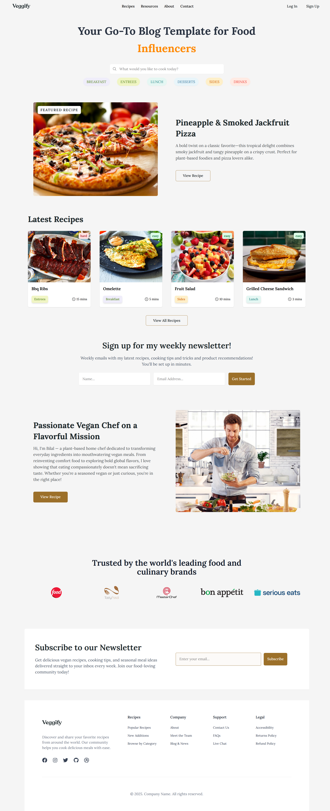
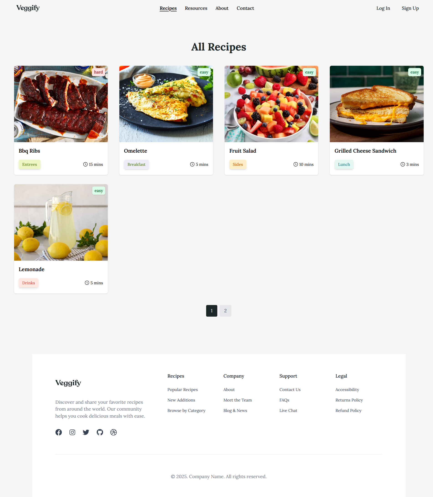
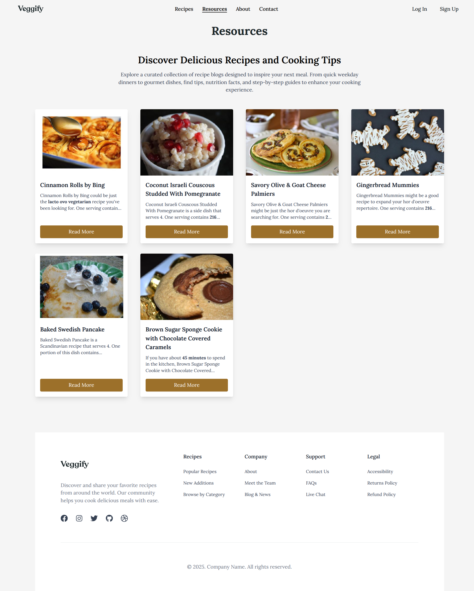
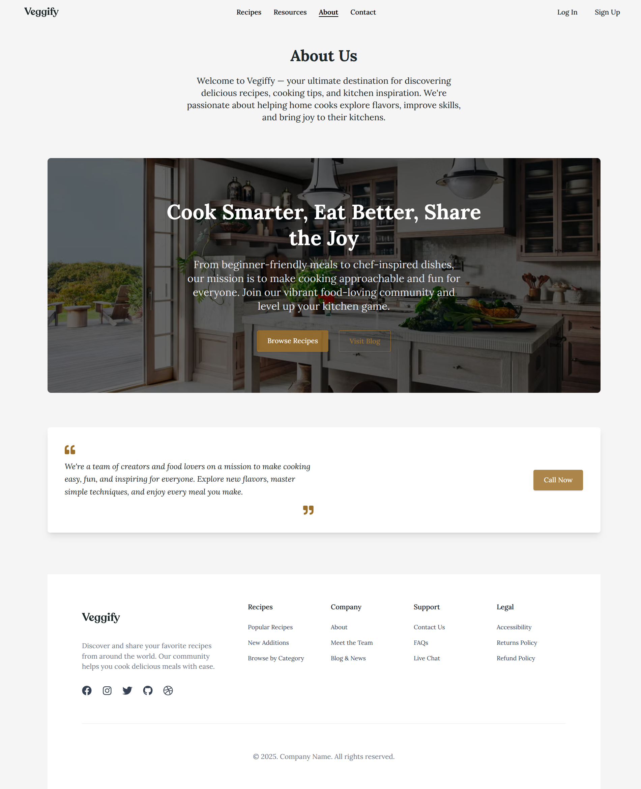
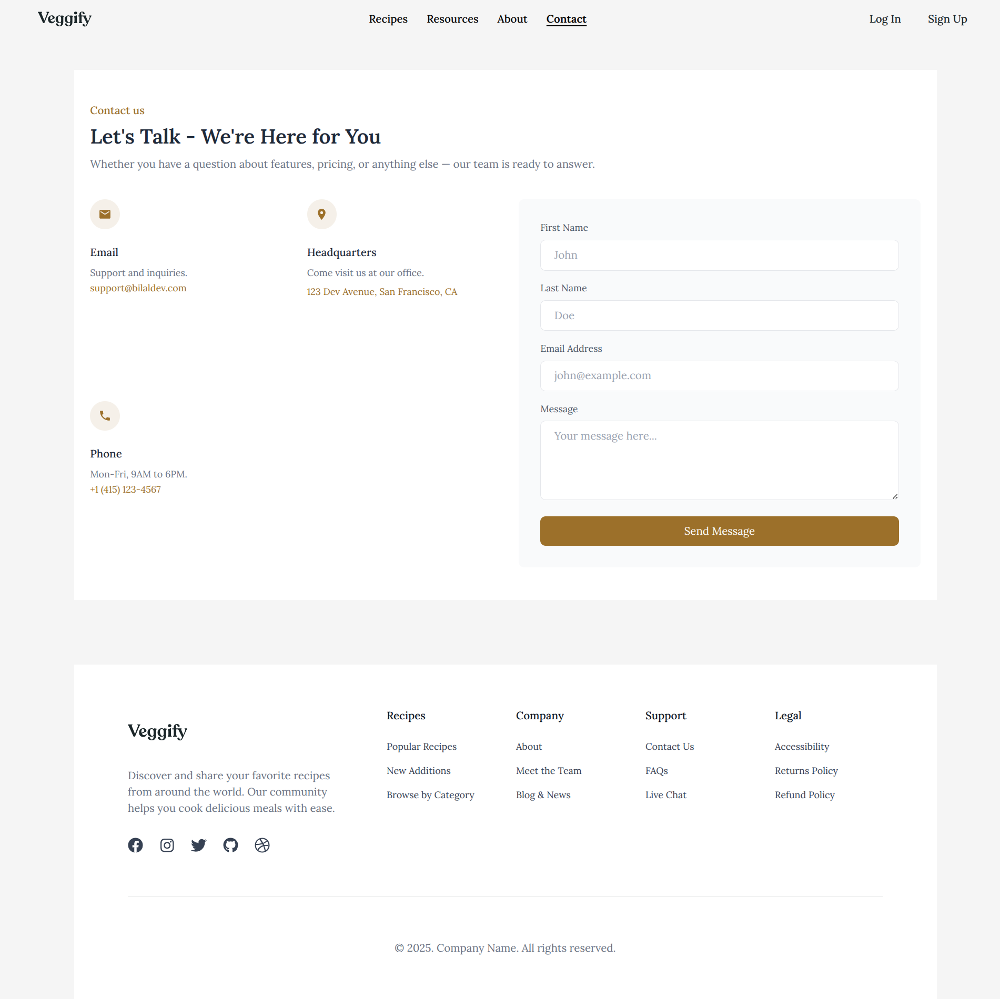
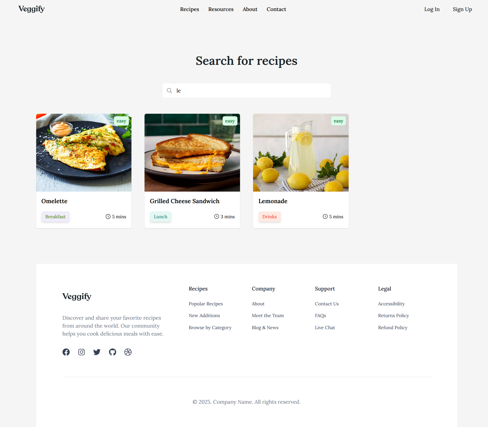
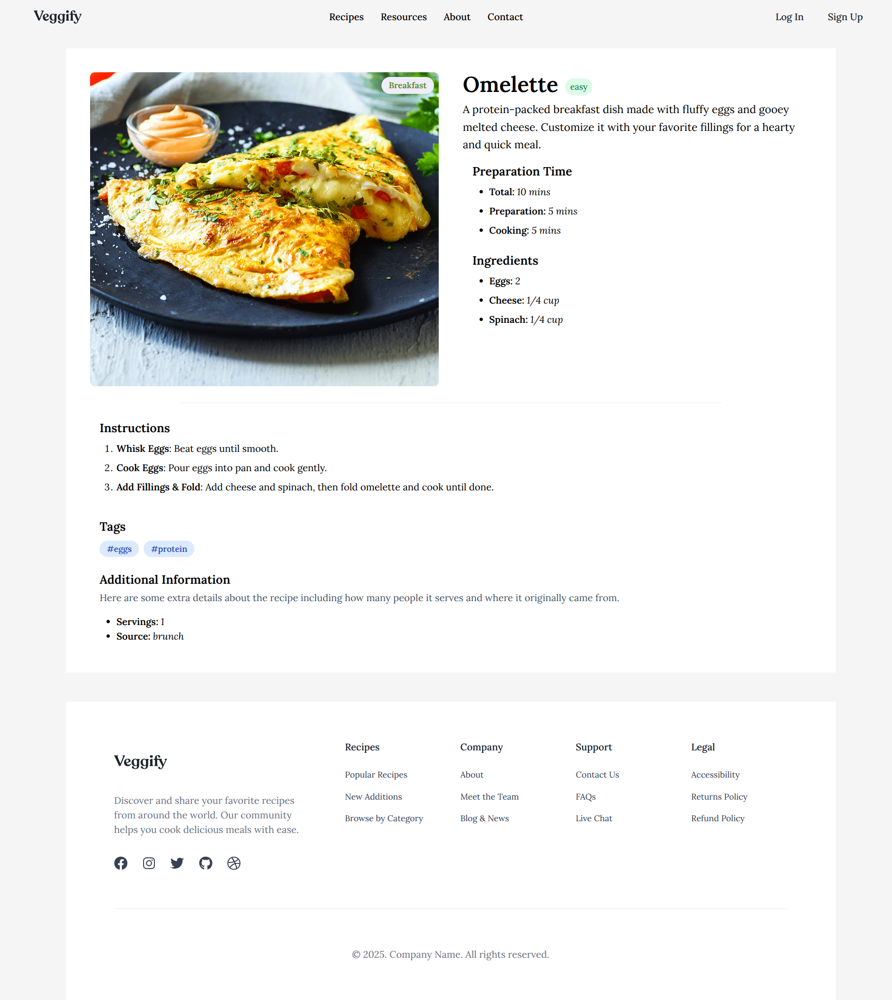
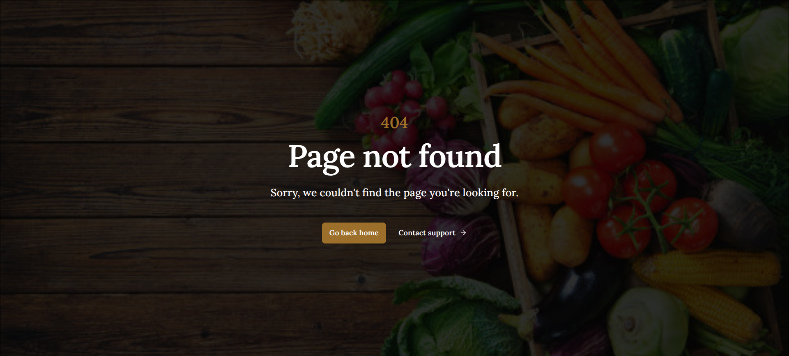

# 🍽️ Vegiffy


**Vegiffy** is a full-stack recipe application where users can explore, read, and interact with delicious recipes and cooking tips. Built with a modern stack including **React**, **TypeScript**, **Express**, and **MongoDB**, the app focuses on performance, scalability, developer experience (DX), and clean architecture.

---

## 🚀 Features

### 🖥️ Frontend

- ✅ **React + TypeScript** – Strong typing and DX enhancements
- 🎨 **Tailwind CSS** – Utility-first styling for rapid UI development
- ⚛️ **React Query** – Data fetching, mutations, and caching
- 🌐 **Axios** – Simplified HTTP requests
- 🔔 **React Hot Toast** – Toast notifications for user feedback
- 🧭 **React Router DOM** – Client-side routing
- 🎯 **React Icons** – Scalable and customizable icons

### 🛠️ Backend

- 🧩 **Express.js + Node.js** – Lightweight and fast API server
- 🛡️ **Zod** – Schema-based validation for request data
- ✍️ **TypeScript** – Type safety across the codebase
- 🔗 **Axios** – Used internally for third-party API integration
- 🗃️ **Mongoose** – MongoDB ODM for schema and data modeling
- 🔓 **CORS** – Configured for secure cross-origin access
- 🧱 **Monolithic Layered Architecture** – Clean separation into routes, controllers, services, and models

---

## 📱 Responsive Design

Vegiffy is **fully responsive**, ensuring an optimal user experience across all devices—from mobile phones and tablets to large desktop screens. The layout and components adjust fluidly to different screen sizes using **Tailwind CSS utility classes** and responsive design best practices.

---

## 🧭 Pages Overview

### 🏠 Home Page

- Hero section with CTA
- Latest Recipes dynamically displayed
- Newsletter signup form
- Trusted Companies section
- Global Footer

### 🍲 Recipes Page

- List of all recipes
- Paginated for improved UX

### 📚 Resources Page

- External blog articles from Spancouines API
- Cooking tips and inspiration

### 📖 About Page

- Hero section
- Inspiring quotes
- Call-to-action button

### 📞 Contact Page

- Contact form for users to reach out to the team

---

## 🗂️ Folder Structure

```
📁 /frontend
└── 📁 src
    ├── 📁 components
    ├── 📁 pages
    ├── 📁 hooks
    ├── 📁 assets
    ├── 📁 ...
    ├── App.tsx
    └── main.tsx


📁 /backend
└── 📁 src
    ├── 📁 configs
    ├── 📁 controllers
    ├── 📁 models
    ├── 📁 routes
    ├── 📁 schemas
    ├── 📁 ...
    └── server.ts
```

---

## ⚙️ Technologies Used

| Layer        | Technologies                                                          |
| ------------ | --------------------------------------------------------------------- |
| Frontend     | React, TypeScript, Tailwind CSS, React Query, React Router DOM, Axios |
| Backend      | Express, Node.js, TypeScript, Zod, Mongoose, Axios, CORS              |
| Database     | MongoDB                                                               |
| Architecture | Monolithic Layered Architecture                                       |

---

## 📦 Setup & Installation

### 📥 Clone the Repository

```bash
git clone https://github.com/Bilalben23/recipe-blog-app.git
cd recipe-blog-app
```

### 🛠 Backend Setup

```bash
cd backend
npm install
cp .env.example .env
# Fill in environment variables (Mongo URI, PORT, etc.)
npm run dev
```

### 💻 Frontend Setup

```bash
cd frontend
npm install
npm run dev
```

---

## 🌐 API Integration

- External blog data from **Spancouines API**
- REST API for:
  - Recipes CRUD
  - Newsletter Signup
  - Contact Messages

---

## 📢 Contribution

Contributions are welcome!  
To contribute:

1. Fork this repo
2. Create a new branch (`git checkout -b feature/your-feature`)
3. Commit your changes
4. Push to your branch
5. Create a Pull Request

---

## 👨‍💻 Author

**Bilal Benyoussef**  
_Full Stack Web Developer | MERN | TypeScript | Crafting Scalable & High-Performance Applications_

---

## 🌍 Live Demo

> 🚀 Check out the live version of Vegiffy:

**🔗 [Live Demo →](https://veggify-frontend.vercel.app)**

Deployed for public access. Explore features like recipe browsing, search, and external resources.

---

### 📸 Screenshots

> Here's a preview of the core pages in the app:

### 🏠 Home Page



### 🍽️ Recipes Page



### 📚 Resources Page



### ℹ️ About Page



### 📞 Contact Page



### 🔍 Search Page



### 📦 Item Page



### 🗂️ Category Page

### 

### 🚫 Not Found Page


